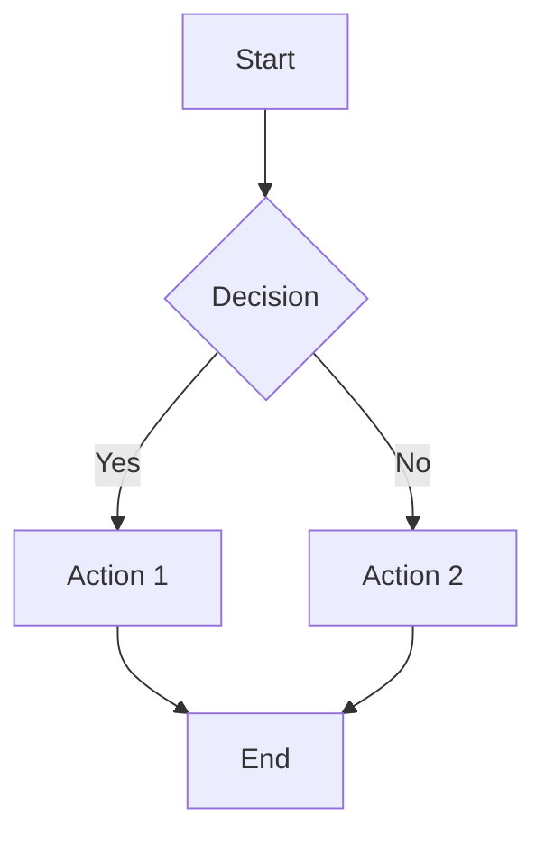

# MarkdownForge

A powerful Node.js CLI tool for forging professional documents from Markdown files to DOCX and PDF formats with full Mermaid diagram support and admonitions. Designed for seamless npx usage without installation.

[](https://badge.fury.io/js/markdownforge)
[](https://opensource.org/licenses/MIT)
[](https://github.com/yourusername/markdownforge/actions)

## Features

- 🚀 **Zero Installation**: Use directly with `npx` - no global installation required
- 📄 **Multiple Formats**: Convert to both PDF and DOCX simultaneously
- 🎨 **Mermaid Diagrams**: Full support for Mermaid diagrams with automatic rendering
- ⚠️ **Admonitions**: Support for styled callout boxes (warning, note, tip, info, etc.)
- 🎭 **Themes**: Multiple built-in themes for professional document styling
- ⚡ **Fast**: Optimized for quick execution and minimal resource usage
- 🔧 **Configurable**: Extensive configuration options via CLI or config files
- 🌐 **Cross-Platform**: Works on Windows, macOS, and Linux

## Quick Start

```bash
# Forge a Markdown file to both PDF and DOCX
npx markdownforge document.md

# Forge to PDF only
npx markdownforge document.md --format pdf

# Forge with custom output directory
npx markdownforge document.md --output ./exports

# Forge with GitHub theme
npx markdownforge document.md --theme github --verbose
```

## Installation

### npx Usage (Recommended)
No installation required! Just use `npx`:

```bash
npx markdownforge your-document.md
```

### Global Installation
```bash
npm install -g markdownforge
markdownforge your-document.md
```

### Local Installation
```bash
npm install markdownforge
npx markdownforge your-document.md
```

## Prerequisites

- **Node.js** >= 16.0.0
- **Pandoc** (for DOCX conversion) - [Installation Guide](https://pandoc.org/installing.html)

The tool will automatically check for dependencies and provide installation instructions if needed.

## Usage

### Basic Usage

```bash
npx markdownforge <input-file> [options]
```

### Options

| Option | Short | Description | Default |
|--------|-------|-------------|---------|
| `--format` | `-f` | Output formats: `pdf`, `docx`, or `pdf,docx` | `pdf,docx` |
| `--output` | `-o` | Output directory | `./output` |
| `--name` | `-n` | Base name for output files | Input filename |
| `--theme` | `-t` | Theme: `default`, `github`, `academic` | `default` |
| `--diagram-format` | | Diagram format: `png`, `svg` | `png` |
| `--verbose` | `-v` | Enable verbose logging | `false` |
| `--help` | `-h` | Show help information | |
| `--version` | `-V` | Show version number | |

### Examples

```bash
# Basic forging
npx markdownforge README.md

# PDF only with custom name
npx markdownforge docs/guide.md --format pdf --name user-guide

# Academic theme with verbose output
npx markdownforge thesis.md --theme academic --verbose

# Custom output directory
npx markdownforge report.md --output ./exports --name final-report
```

## Mermaid Diagram Support

The tool automatically detects and renders Mermaid diagrams in your Markdown files:

````markdown

````

Supported diagram types:
- Flowcharts
- Sequence diagrams
- Class diagrams
- State diagrams
- Gantt charts
- Pie charts
- And more!

## Admonition Support

FileConverter CLI supports styled admonitions (callout boxes) for highlighting important information:

````markdown
!!! warning "Custom Title"
    This is a warning admonition with a custom title.

!!! note
    This is a note admonition with the default "Note" title.
````

### Supported Admonition Types

| Type | Icon | Use Case |
|------|------|----------|
| `warning` | ⚠️ | Warnings and cautions |
| `note` | 📝 | Important notes |
| `info` | ℹ️ | Additional information |
| `tip` | 💡 | Helpful tips and suggestions |
| `success` | ✅ | Success messages |
| `error` | ❌ | Error messages |
| `danger` | 🚨 | Critical warnings |

### Admonition Syntax

```markdown
!!! type "Optional Custom Title"
    Content goes here with 4-space indentation.
    
    Multiple paragraphs are supported.
    
    You can use **bold**, *italic*, and `code` formatting.
```

Admonitions are rendered with:
- **PDF**: Colored borders, backgrounds, and icons
- **DOCX**: Styled text boxes with colored borders and backgrounds

See `examples/admonitions-demo.md` for comprehensive examples.

## Configuration

MarkdownForge supports extensive configuration for customizing conversion settings. Create a configuration file in your project root using any of these formats:

- `.markdownforgerc` (JSON)
- `.markdownforgerc.json`
- `.markdownforgerc.yaml` / `.markdownforgerc.yml`
- `.markdownforgerc.js`
- `markdownforge.config.js`
- `package.json` (under `markdownforge` key)

### Basic Configuration

```json
{
  "format": ["pdf", "docx"],
  "output": "./output",
  "theme": "default",
  "diagramFormat": "png",
  "verbose": false
}
```

### Advanced DOCX Formatting

Customize DOCX output with detailed formatting options:

```json
{
  "docx": {
    "formatting": {
      "headingSpacing": {
        "before": 400,
        "after": 200
      },
      "paragraphSpacing": {
        "before": 0,
        "after": 150
      },
      "sectionSpacing": {
        "before": 300,
        "after": 200
      },
      "fontSize": 22,
      "headingFontSizes": {
        "h1": 32,
        "h2": 28,
        "h3": 24,
        "h4": 22,
        "h5": 20,
        "h6": 18
      },
      "colors": {
        "headings": "2E74B5",
        "text": "000000",
        "code": "D73A49"
      },
      "alignment": {
        "paragraphs": "justified",
        "headings": "left"
      }
    }
  }
}
```

### PDF Configuration

```json
{
  "pdf": {
    "format": "A4",
    "margin": {
      "top": "1in",
      "right": "1in",
      "bottom": "1in",
      "left": "1in"
    },
    "displayHeaderFooter": false,
    "printBackground": true
  }
}
```

### Mermaid Diagram Configuration

```json
{
  "mermaid": {
    "theme": "default",
    "backgroundColor": "white",
    "width": 800,
    "height": 600
  }
}
```

### Configuration Options

| Option | Type | Default | Description |
|--------|------|---------|-------------|
| `format` | Array | `["pdf", "docx"]` | Output formats |
| `output` | String | `"./output"` | Output directory |
| `theme` | String | `"default"` | Document theme |
| `diagramFormat` | String | `"png"` | Diagram output format |
| `verbose` | Boolean | `false` | Enable verbose logging |

#### DOCX Formatting Options

| Option | Type | Default | Description |
|--------|------|---------|-------------|
| `headingSpacing.before` | Number | `400` | Space before headings (twips) |
| `headingSpacing.after` | Number | `200` | Space after headings (twips) |
| `paragraphSpacing.before` | Number | `0` | Space before paragraphs (twips) |
| `paragraphSpacing.after` | Number | `150` | Space after paragraphs (twips) |
| `sectionSpacing.before` | Number | `300` | Space before sections (twips) |
| `sectionSpacing.after` | Number | `200` | Space after sections (twips) |
| `fontSize` | Number | `22` | Default font size (half-points) |
| `headingFontSizes.h1-h6` | Number | Various | Heading font sizes (half-points) |
| `colors.headings` | String | `"2E74B5"` | Heading color (hex) |
| `colors.text` | String | `"000000"` | Text color (hex) |
| `colors.code` | String | `"D73A49"` | Code color (hex) |
| `alignment.paragraphs` | String | `"justified"` | Paragraph alignment: left, center, right, justified |
| `alignment.headings` | String | `"left"` | Heading alignment: left, center, right, justified |

> **Note**: Spacing values are in twips (1/20th of a point). Font sizes are in half-points (22 = 11pt).

### Example Configuration File

Copy the example configuration and customize as needed:

```bash
cp .markdownforgerc.example .markdownforgerc
```

### Environment Variables

```bash
# Disable anonymous usage analytics
export MARKDOWNFORGE_ANALYTICS=false

# Custom temporary directory
export MARKDOWNFORGE_TEMP_DIR=/custom/temp/path
```

## Themes

### Available Themes

| Theme | Description | Best For |
|-------|-------------|----------|
| `default` | Clean, professional styling | General documents |
| `github` | GitHub-flavored styling | Technical documentation |
| `academic` | Academic paper formatting | Research papers, reports |

### Custom Themes

You can create custom themes by providing CSS files:

```bash
npx markdownforge document.md --theme ./custom-theme.css
```

## API Usage

You can also use MarkdownForge programmatically:

```javascript
const { DocumentProcessor } = require('markdownforge');

const processor = new DocumentProcessor({
  format: ['pdf', 'docx'],
  theme: 'github',
  verbose: true
});

async function forge() {
  try {
    const result = await processor.processDocument('./input.md');
    console.log('Forging completed:', result.outputs);
  } catch (error) {
    console.error('Forging failed:', error.message);
  }
}

forge();
```

## Architecture

MarkdownForge is built with a modular architecture:

```
┌─────────────────┐    ┌──────────────────┐    ┌─────────────────┐
│   CLI Interface │────│ Document         │────│ Output          │
│                 │    │ Processor        │    │ Manager         │
└─────────────────┘    └──────────────────┘    └─────────────────┘
                                │
                    ┌───────────┼───────────┐
                    │           │           │
            ┌───────▼────┐ ┌────▼────┐ ┌───▼──────┐
            │  Mermaid   │ │  DOCX   │ │   PDF    │
            │  Renderer  │ │Converter│ │Converter │
            └────────────┘ └─────────┘ └──────────┘
```

For detailed architecture documentation, see [docs/architecture.md](docs/architecture.md).

## Performance

### Benchmarks

| Document Size | Processing Time | Memory Usage |
|---------------|----------------|--------------|
| Small (< 1MB) | < 5 seconds | < 100MB |
| Medium (1-10MB) | < 30 seconds | < 200MB |
| Large (> 10MB) | < 2 minutes | < 500MB |

### Optimization Features

- **Concurrent Processing**: Diagrams rendered in parallel
- **Resource Management**: Automatic cleanup of temporary files
- **Caching**: Intelligent diagram caching to avoid re-rendering
- **Memory Optimization**: Streaming for large files

## Troubleshooting

### Common Issues

#### Pandoc Not Found
```bash
Error: Pandoc not found. Please install Pandoc to enable DOCX conversion.
```
**Solution**: Install Pandoc from [pandoc.org](https://pandoc.org/installing.html)

#### Puppeteer Launch Failed
```bash
Error: Failed to launch Chrome browser
```
**Solution**: Install Chrome dependencies:
- **Ubuntu/Debian**: `sudo apt-get install -y chromium-browser`
- **CentOS/RHEL**: `sudo yum install -y chromium`

#### Permission Denied
```bash
Error: EACCES: permission denied, mkdir './output'
```
**Solution**: Check directory permissions or use a different output directory

### Debug Mode

Enable verbose logging for detailed troubleshooting:

```bash
npx markdownforge document.md --verbose
```

## Contributing

We welcome contributions! Please see our [Contributing Guide](CONTRIBUTING.md) for details.

### Development Setup

```bash
# Clone the repository
git clone https://github.com/yourusername/markdownforge.git
cd markdownforge

# Install dependencies
npm install

# Run tests
npm test

# Run in development mode
npm start -- your-test-file.md
```

### Testing

```bash
# Run all tests
npm test

# Run unit tests only
npm run test:unit

# Run integration tests only
npm run test:integration

# Run tests in watch mode
npm run test:watch
```

## Roadmap

- [ ] **Plugin System**: Support for custom converters and themes
- [ ] **Batch Processing**: Convert multiple files simultaneously
- [ ] **Watch Mode**: Auto-convert on file changes
- [ ] **Template Support**: Custom document templates
- [ ] **Cloud Integration**: Direct upload to cloud storage
- [ ] **Web Interface**: Browser-based conversion tool

## License

MIT License - see the [LICENSE](LICENSE) file for details.

## Support

- 🐛 **Bug Reports**: [GitHub Issues](https://github.com/yourusername/markdownforge/issues)
- 💡 **Feature Requests**: [GitHub Discussions](https://github.com/yourusername/markdownforge/discussions)
- 📚 **Documentation**: [Project Wiki](https://github.com/yourusername/markdownforge/wiki)
- 💬 **Community**: [Discord Server](https://discord.gg/your-server)

## Acknowledgments

- [Pandoc](https://pandoc.org/) for document conversion
- [Puppeteer](https://pptr.dev/) for PDF generation and diagram rendering
- [Mermaid](https://mermaid-js.github.io/) for diagram syntax
- [Commander.js](https://github.com/tj/commander.js/) for CLI framework

---

**Made with ❤️ for forging beautiful documents**

[](https://nodei.co/npm/markdownforge/)