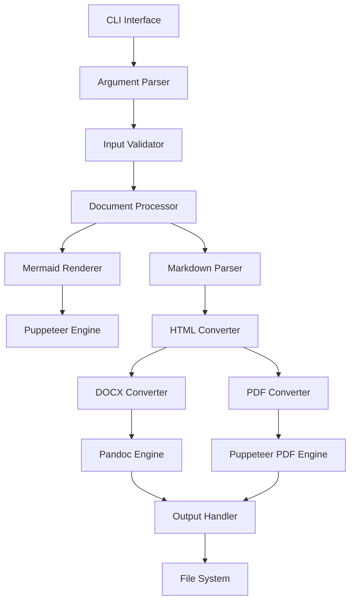
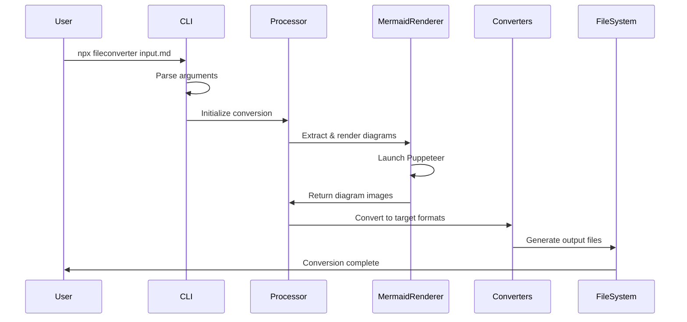

# File Converter CLI Architecture

## System Overview

A Node.js CLI tool for converting Markdown files to DOCX and PDF formats with Mermaid diagram support, designed for global NPM distribution and npx execution.

## Architecture Diagram



## Core Components

### 1. CLI Interface Layer
**Responsibility:** Command-line interface and user interaction
- Entry point for npx execution
- Command parsing and validation
- Help system and usage information
- Progress indicators

**Files:**
- `bin/fileconverter.js` - Executable entry point
- `src/cli/commander.js` - Command definitions and parsing
- `src/cli/help.js` - Help system and usage documentation

### 2. Input Processing Layer
**Responsibility:** File validation and preprocessing
- Input file validation
- Format detection
- Error handling for missing files
- Configuration validation

**Files:**
- `src/validators/fileValidator.js` - Input file validation
- `src/validators/configValidator.js` - Configuration validation
- `src/utils/fileUtils.js` - File system utilities

### 3. Document Processing Core
**Responsibility:** Orchestrate conversion workflow
- Coordinate conversion pipeline
- Handle multiple output formats
- Manage temporary files
- Error propagation and recovery

**Files:**
- `src/core/documentProcessor.js` - Main processing orchestrator
- `src/core/conversionPipeline.js` - Conversion workflow management
- `src/core/tempFileManager.js` - Temporary file handling

### 4. Mermaid Rendering Engine
**Responsibility:** Convert Mermaid diagrams to images
- Parse Mermaid syntax from Markdown
- Render diagrams using Puppeteer
- Generate SVG/PNG outputs
- Handle rendering errors gracefully

**Files:**
- `src/renderers/mermaidRenderer.js` - Main Mermaid processing
- `src/renderers/diagramExtractor.js` - Extract diagrams from Markdown
- `src/renderers/puppeteerManager.js` - Browser automation management

### 5. Format Converters
**Responsibility:** Handle specific format conversions

#### DOCX Converter
- Utilize Pandoc for Markdown to DOCX conversion
- Embed rendered diagrams
- Handle Word document formatting

#### PDF Converter
- Convert HTML to PDF using Puppeteer
- Maintain document structure and styling
- Handle page breaks and formatting

**Files:**
- `src/converters/docxConverter.js` - DOCX conversion logic
- `src/converters/pdfConverter.js` - PDF conversion logic
- `src/converters/htmlConverter.js` - Markdown to HTML conversion

### 6. Output Management
**Responsibility:** Handle output file generation and cleanup
- Manage output directory structure
- Handle file naming conventions
- Clean up temporary files
- Provide conversion summaries

**Files:**
- `src/output/outputManager.js` - Output file management
- `src/output/cleanupManager.js` - Temporary file cleanup
- `src/output/reportGenerator.js` - Conversion reports

## Data Flow Architecture



## NPM Package Structure

```
fileconverter/
├── bin/
│   └── fileconverter.js           # Executable entry point
├── src/
│   ├── cli/
│   │   ├── commander.js           # CLI command definitions
│   │   └── help.js                # Help system
│   ├── core/
│   │   ├── documentProcessor.js   # Main orchestrator
│   │   ├── conversionPipeline.js  # Workflow management
│   │   └── tempFileManager.js     # Temp file handling
│   ├── validators/
│   │   ├── fileValidator.js       # Input validation
│   │   └── configValidator.js     # Config validation
│   ├── renderers/
│   │   ├── mermaidRenderer.js     # Mermaid processing
│   │   ├── diagramExtractor.js    # Diagram extraction
│   │   └── puppeteerManager.js    # Browser management
│   ├── converters/
│   │   ├── docxConverter.js       # DOCX conversion
│   │   ├── pdfConverter.js        # PDF conversion
│   │   └── htmlConverter.js       # HTML conversion
│   ├── output/
│   │   ├── outputManager.js       # Output management
│   │   ├── cleanupManager.js      # Cleanup utilities
│   │   └── reportGenerator.js     # Conversion reports
│   └── utils/
│       ├── fileUtils.js           # File utilities
│       ├── logger.js              # Logging system
│       └── constants.js           # Application constants
├── tests/
│   ├── unit/                      # Unit tests
│   ├── integration/               # Integration tests
│   └── fixtures/                  # Test fixtures
├── docs/
│   ├── architecture.md            # This document
│   ├── api.md                     # API documentation
│   └── examples/                  # Usage examples
├── package.json                   # NPM configuration
├── README.md                      # Project documentation
├── .gitignore                     # Git ignore rules
└── .npmignore                     # NPM ignore rules
```

## External Dependencies

### Runtime Dependencies
- **puppeteer** - Headless Chrome for rendering
- **commander** - CLI framework
- **markdown-it** - Markdown parsing
- **fs-extra** - Enhanced file system operations
- **path** - Path manipulation utilities

### System Dependencies
- **pandoc** - Document conversion (DOCX generation)
- **Node.js** >= 16.0.0 - Runtime environment

## Error Handling Strategy

### 1. Graceful Degradation
- Continue processing when non-critical errors occur
- Provide warnings for missing optional features
- Fallback mechanisms for external dependencies

### 2. Error Categories
- **Input Errors:** Invalid files, missing permissions
- **Processing Errors:** Mermaid rendering failures, conversion issues
- **Output Errors:** Disk space, permission issues
- **System Errors:** Missing dependencies, environment issues

### 3. User Feedback
- Clear error messages with actionable suggestions
- Progress indicators for long-running operations
- Verbose mode for debugging
- Exit codes for programmatic usage

## Performance Considerations

### 1. Resource Management
- Efficient Puppeteer instance management
- Memory optimization for large documents
- Parallel processing where possible
- Temporary file cleanup

### 2. Caching Strategy
- Cache rendered diagrams to avoid re-rendering
- Reuse Puppeteer instances when possible
- Optimize image generation settings

### 3. Scalability
- Support for batch processing
- Configurable resource limits
- Progress tracking for large files

## Security Considerations

### 1. Input Sanitization
- Validate all user inputs
- Sanitize file paths to prevent directory traversal
- Limit file sizes to prevent DoS attacks

### 2. Sandboxing
- Run Puppeteer in sandboxed mode
- Isolate temporary file operations
- Validate Mermaid diagram syntax

### 3. Dependency Security
- Regular security audits of dependencies
- Pin dependency versions
- Monitor for vulnerabilities

## Configuration Management

### 1. Configuration Sources
- Command-line arguments (highest priority)
- Configuration files (`.fileconverterrc`)
- Environment variables
- Default values (lowest priority)

### 2. Configurable Options
- Output formats and quality settings
- Diagram rendering options
- Temporary file locations
- Logging levels and outputs

## Testing Strategy

### 1. Unit Tests
- Individual component testing
- Mock external dependencies
- Error condition testing

### 2. Integration Tests
- End-to-end conversion workflows
- Real file processing tests
- External dependency integration

### 3. Performance Tests
- Large file handling
- Memory usage monitoring
- Concurrent processing tests

## Deployment and Distribution

### 1. NPM Publishing
- Automated CI/CD pipeline
- Version management and tagging
- Pre-publish testing and validation

### 2. npx Optimization
- Minimal package size
- Fast installation and execution
- Clear progress indicators

### 3. Cross-Platform Support
- Windows, macOS, and Linux compatibility
- Platform-specific optimizations
- Consistent behavior across environments