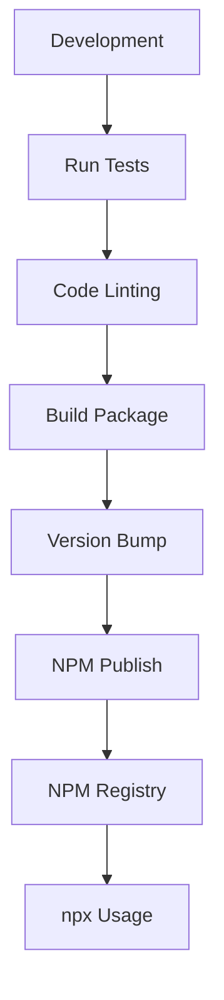
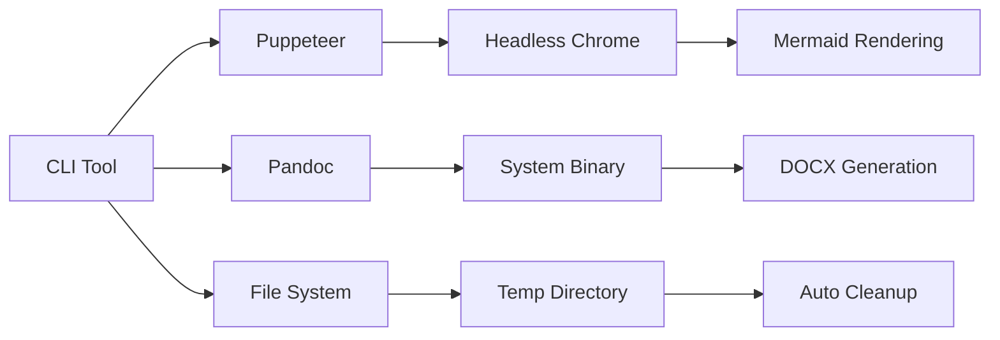

# MarkdownForge Deployment and NPM Publishing Strategy

## NPM Publishing Configuration

### Publishing Workflow



### Pre-publishing Checklist

1. **Code Quality**
   - All tests passing (`npm test`)
   - Linting clean (`npm run lint`)
   - Code formatted (`npm run format`)
   - Coverage threshold met (80%+)

2. **Documentation**
   - README.md updated
   - CHANGELOG.md updated
   - API documentation current
   - Examples working

3. **Package Configuration**
   - Version number incremented
   - Dependencies up to date
   - Security vulnerabilities addressed
   - Files array properly configured

4. **Testing**
   - Unit tests passing
   - Integration tests passing
   - Manual testing on target platforms
   - npx execution verified

### Automated CI/CD Pipeline

```yaml
# .github/workflows/publish.yml
name: Publish to NPM

on:
  push:
    tags:
      - 'v*'

jobs:
  test:
    runs-on: ubuntu-latest
    strategy:
      matrix:
        node-version: [16, 18, 20]
    steps:
      - uses: actions/checkout@v4
      - name: Use Node.js ${{ matrix.node-version }}
        uses: actions/setup-node@v4
        with:
          node-version: ${{ matrix.node-version }}
      - run: npm ci
      - run: npm test
      
  publish:
    needs: test
    runs-on: ubuntu-latest
    steps:
      - uses: actions/checkout@v4
      - uses: actions/setup-node@v4
        with:
          node-version: '18'
          registry-url: 'https://registry.npmjs.org'
      - run: npm ci
      - run: npm publish
        env:
          NODE_AUTH_TOKEN: ${{ secrets.NPM_TOKEN }}
```

## npx Optimization Strategy

### Package Size Optimization

1. **Minimal Dependencies**
   - Use lightweight alternatives where possible
   - Bundle only essential files
   - Exclude development dependencies from package

2. **Files Configuration**
   ```json
   {
     "files": [
       "bin/",
       "src/",
       "README.md",
       "LICENSE"
     ]
   }
   ```

3. **Lazy Loading**
   - Load heavy dependencies only when needed
   - Implement progressive installation for optional features

### Fast Execution

1. **Dependency Check Script**
   ```javascript
   // scripts/check-dependencies.js
   const { exec } = require('child_process');
   const chalk = require('chalk');

   async function checkPandoc() {
     try {
       await exec('pandoc --version');
       console.log(chalk.green('✓ Pandoc is available'));
     } catch (error) {
       console.log(chalk.yellow('⚠ Pandoc not found. DOCX conversion will be unavailable.'));
       console.log('Install Pandoc: https://pandoc.org/installing.html');
     }
   }

   checkPandoc();
   ```

2. **Efficient Puppeteer Usage**
   - Reuse browser instances
   - Optimize launch arguments
   - Minimal Chrome flags for headless operation

## System Integration Points

### External Dependencies Integration



### Dependency Management Strategy

1. **Pandoc Integration**
   ```javascript
   // Check Pandoc availability
   const checkPandoc = async () => {
     try {
       const { stdout } = await exec('pandoc --version');
       return { available: true, version: stdout.split('\n')[0] };
     } catch (error) {
       return { 
         available: false, 
         error: 'Pandoc not found. Please install from https://pandoc.org' 
       };
     }
   };
   ```

2. **Puppeteer Configuration**
   ```javascript
   // Optimized Puppeteer launch
   const launchBrowser = async () => {
     return await puppeteer.launch({
       headless: 'new',
       args: [
         '--no-sandbox',
         '--disable-setuid-sandbox',
         '--disable-dev-shm-usage',
         '--disable-accelerated-2d-canvas',
         '--no-first-run',
         '--no-zygote',
         '--single-process',
         '--disable-gpu'
       ]
     });
   };
   ```

## Platform Compatibility

### Cross-Platform Support Matrix

| Feature | Windows | macOS | Linux |
|---------|---------|-------|-------|
| PDF Generation | ✅ | ✅ | ✅ |
| DOCX Generation | ⚠* | ✅ | ✅ |
| Mermaid Rendering | ✅ | ✅ | ✅ |
| CLI Interface | ✅ | ✅ | ✅ |

*Requires Pandoc installation on Windows

### Platform-Specific Optimizations

1. **Windows**
   ```javascript
   // Handle Windows path separators
   const path = require('path');
   const normalizedPath = path.resolve(inputPath).replace(/\\/g, '/');
   ```

2. **macOS/Linux**
   ```javascript
   // Optimize for Unix-based systems
   const tempDir = process.env.TMPDIR || '/tmp';
   ```

## Monitoring and Analytics

### Usage Analytics (Optional)

```javascript
// Optional anonymous usage tracking
const trackUsage = async (command, options) => {
  if (process.env.MARKDOWNFORGE_ANALYTICS !== 'false') {
    // Send anonymous usage data
    const payload = {
      command,
      formats: options.format,
      platform: process.platform,
      nodeVersion: process.version,
      timestamp: new Date().toISOString()
    };
    
    // Send to analytics endpoint (if configured)
  }
};
```

### Error Reporting

```javascript
// Error reporting service integration
const reportError = async (error, context) => {
  if (process.env.NODE_ENV === 'production') {
    // Send error reports to monitoring service
    console.error('Error reported:', error.message);
  }
};
```

## Security Considerations

### Input Validation

```javascript
// Secure input validation
const validateInput = (filePath) => {
  // Prevent directory traversal
  const normalized = path.normalize(filePath);
  if (normalized.includes('..')) {
    throw new Error('Invalid file path: directory traversal detected');
  }
  
  // Check file extension
  const ext = path.extname(normalized).toLowerCase();
  if (ext !== '.md' && ext !== '.markdown') {
    throw new Error('Invalid file type: only Markdown files are supported');
  }
  
  return normalized;
};
```

### Sandboxing

```javascript
// Secure Puppeteer execution
const secureRender = async (content) => {
  const browser = await puppeteer.launch({
    headless: true,
    args: [
      '--no-sandbox',
      '--disable-setuid-sandbox',
      '--disable-web-security',
      '--disable-features=site-per-process'
    ]
  });
  
  try {
    // Render content safely
    return await renderContent(browser, content);
  } finally {
    await browser.close();
  }
};
```

## Performance Benchmarks

### Target Performance Metrics

| Document Size | Expected Time | Memory Usage |
|---------------|---------------|--------------|
| Small (< 1MB) | < 5 seconds | < 100MB |
| Medium (1-10MB) | < 30 seconds | < 200MB |
| Large (> 10MB) | < 2 minutes | < 500MB |

### Optimization Strategies

1. **Memory Management**
   - Stream processing for large files
   - Garbage collection optimization
   - Resource cleanup after processing

2. **Concurrent Processing**
   - Parallel diagram rendering
   - Asynchronous file operations
   - Background cleanup tasks

## Maintenance and Updates

### Version Management

```json
{
  "version": "1.0.0",
  "engines": {
    "node": ">=16.0.0"
  },
  "dependencies": {
    "puppeteer": "^21.5.2"
  }
}
```

### Update Strategy

1. **Semantic Versioning**
   - Major: Breaking changes
   - Minor: New features
   - Patch: Bug fixes

2. **Dependency Updates**
   - Regular security updates
   - Performance improvements
   - Feature enhancements

3. **Backward Compatibility**
   - Maintain CLI interface stability
   - Deprecation warnings for removed features
   - Migration guides for major updates

## Support and Documentation

### User Support Channels

1. **GitHub Issues**
   - Bug reports
   - Feature requests
   - General questions

2. **Documentation**
   - README with quick start
   - Detailed API documentation
   - Troubleshooting guide

3. **Community**
   - Stack Overflow tags
   - Discord/Slack channels
   - Community contributions

### Troubleshooting Guide

```markdown
## Common Issues

### Pandoc Not Found
- **Solution**: Install Pandoc from https://pandoc.org
- **Verification**: Run `pandoc --version`

### Puppeteer Launch Failed
- **Solution**: Install Chrome dependencies
- **Linux**: `apt-get install -y chromium-browser`

### Permission Denied
- **Solution**: Check output directory permissions
- **Command**: `chmod 755 ./output`