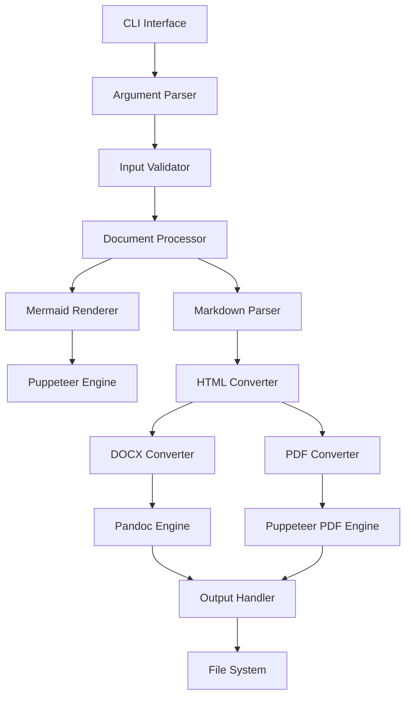

# MarkdownForge Documentation

Welcome to the comprehensive documentation for **MarkdownForge** - a powerful Node.js CLI tool for forging professional documents from Markdown files to DOCX and PDF formats with full Mermaid diagram support and admonitions.

## 🚀 Quick Start

```bash
# Use directly with npx (no installation required)
npx markdownforge document.md

# Convert to specific format
npx markdownforge document.md --format pdf

# Use custom theme and output directory
npx markdownforge document.md --theme github --output ./exports
```

## ✨ Key Features

- **🚀 Zero Installation**: Use directly with `npx` - no global installation required
- **📄 Multiple Formats**: Convert to both PDF and DOCX simultaneously
- **🎨 Mermaid Diagrams**: Full support for Mermaid diagrams with automatic rendering
- **⚠️ Admonitions**: Support for styled callout boxes (warning, note, tip, info, etc.)
- **🎭 Themes**: Multiple built-in themes for professional document styling
- **⚡ Fast**: Optimized for quick execution and minimal resource usage
- **🔧 Configurable**: Extensive configuration options via CLI or config files
- **🌐 Cross-Platform**: Works on Windows, macOS, and Linux

## 📊 Project Status

[](https://github.com/rauofthameem/markdownforge/actions)
[](https://opensource.org/licenses/MIT)
[](https://nodejs.org/)
[](https://badge.fury.io/js/markdownforge)

## 🏗️ Architecture Overview



## 📚 Documentation Sections

### Getting Started
- **[Installation](installation.md)** - Setup and prerequisites
- **[Quick Start](quickstart.md)** - Get up and running in minutes

### Documentation
- **[API Reference](api.md)** - Complete CLI and programmatic API
- **[Architecture](architecture.md)** - System design and components
- **[Configuration](configuration.md)** - Advanced configuration options

### Development
- **[Deployment](deployment.md)** - Publishing and deployment strategies
- **[Contributing](contributing.md)** - How to contribute to the project

### Resources
- **[Status Badges](badges.md)** - Project status and badges
- **[Test Coverage](coverage.md)** - Code coverage information

## 🎯 Use Cases

### Technical Documentation
Perfect for converting technical documentation, API references, and system architecture documents with embedded diagrams.

### Academic Papers
Generate professional academic papers with proper formatting, citations, and mathematical expressions.

### Business Reports
Create polished business reports with charts, diagrams, and professional styling.

### Project Documentation
Maintain project documentation in Markdown and generate distributable formats for stakeholders.

## 🤝 Community & Support

- **🐛 Bug Reports**: [GitHub Issues](https://github.com/rauofthameem/markdownforge/issues)
- **💡 Feature Requests**: [GitHub Discussions](https://github.com/rauofthameem/markdownforge/discussions)
- **📚 Documentation**: [Project Wiki](https://github.com/rauofthameem/markdownforge/wiki)

## 📄 License

This project is licensed under the MIT License - see the [LICENSE](https://github.com/rauofthameem/markdownforge/blob/main/LICENSE) file for details.

---

**Made with ❤️ for forging beautiful documents**