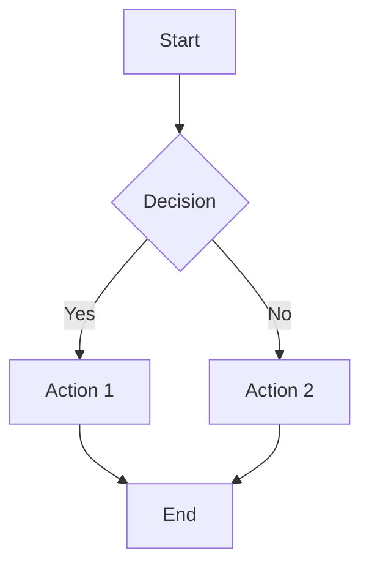

# Quick Start

Get up and running with MarkdownForge in minutes! This guide will walk you through the basic usage and common scenarios.

## Basic Usage

The simplest way to use MarkdownForge:

```bash
# Convert to both PDF and DOCX (default)
npx markdownforge document.md
```

This will:
- Create an `output/` directory
- Generate `document.pdf` and `document.docx`
- Render any Mermaid diagrams
- Process admonitions and styling

## Common Commands

### Convert to Specific Format

```bash
# PDF only
npx markdownforge document.md --format pdf

# DOCX only
npx markdownforge document.md --format docx

# Both formats (explicit)
npx markdownforge document.md --format pdf,docx
```

### Custom Output Location

```bash
# Custom output directory
npx markdownforge document.md --output ./exports

# Custom filename
npx markdownforge document.md --name "final-report"

# Both custom directory and name
npx markdownforge document.md --output ./dist --name "user-guide"
```

### Themes and Styling

```bash
# Use GitHub theme
npx markdownforge document.md --theme github

# Use academic theme
npx markdownforge document.md --theme academic

# Default theme (explicit)
npx markdownforge document.md --theme default
```

### Verbose Output

```bash
# Enable detailed logging
npx markdownforge document.md --verbose
```

## Example Workflows

### Technical Documentation

```bash
# Convert API documentation with GitHub styling
npx markdownforge api-docs.md \
  --theme github \
  --output ./docs-dist \
  --name "api-reference" \
  --verbose
```

### Academic Paper

```bash
# Generate academic paper with proper formatting
npx markdownforge thesis.md \
  --theme academic \
  --format pdf \
  --output ./submission
```

### Business Report

```bash
# Create professional business report
npx markdownforge quarterly-report.md \
  --format pdf,docx \
  --output ./reports \
  --name "Q4-2024-Report"
```

## Mermaid Diagrams

MarkdownForge automatically detects and renders Mermaid diagrams:

````markdown

````

Supported diagram types:
- Flowcharts
- Sequence diagrams
- Class diagrams
- State diagrams
- Gantt charts
- Pie charts
- Git graphs
- User journey maps

## Admonitions

Add styled callout boxes to highlight important information:

```markdown
!!! warning "Important Notice"
    This is a warning admonition with a custom title.

!!! note
    This is a note admonition with the default "Note" title.

!!! tip "Pro Tip"
    Use admonitions to make your documents more engaging!
```

Available types:
- `warning` ⚠️ - Warnings and cautions
- `note` 📝 - Important notes
- `info` ℹ️ - Additional information
- `tip` 💡 - Helpful tips
- `success` ✅ - Success messages
- `error` ❌ - Error messages
- `danger` 🚨 - Critical warnings

## Configuration File

Create a `.markdownforgerc` file for project-specific settings:

```json
{
  "format": ["pdf", "docx"],
  "output": "./output",
  "theme": "github",
  "verbose": false,
  "pdf": {
    "format": "A4",
    "margin": {
      "top": "1in",
      "right": "1in",
      "bottom": "1in",
      "left": "1in"
    }
  }
}
```

## Real-World Examples

### Project Documentation

```bash
# Convert README with examples
npx markdownforge README.md \
  --theme github \
  --output ./docs \
  --name "project-overview"
```

### Meeting Notes

```bash
# Quick meeting notes conversion
npx markdownforge meeting-notes.md \
  --format pdf \
  --output ./meetings
```

### Tutorial Series

```bash
# Convert tutorial with diagrams
npx markdownforge tutorial-part-1.md \
  --theme default \
  --diagram-format svg \
  --verbose
```

## Tips and Best Practices

### 📝 Writing Tips

1. **Use descriptive headings** - They become bookmarks in PDFs
2. **Include diagrams** - Mermaid diagrams enhance understanding
3. **Add admonitions** - Highlight important information
4. **Structure content** - Use consistent heading hierarchy

### ⚡ Performance Tips

1. **Use npx for occasional use** - No installation overhead
2. **Install globally for frequent use** - Faster execution
3. **Enable verbose mode for debugging** - Identify bottlenecks
4. **Optimize images** - Smaller files process faster

### 🎨 Styling Tips

1. **Choose appropriate themes** - GitHub for technical, Academic for papers
2. **Consistent formatting** - Use the same theme across related documents
3. **Test output formats** - PDF and DOCX may render differently
4. **Preview before final** - Check formatting in target format

## Troubleshooting Quick Fixes

### Pandoc Issues
```bash
# Check if Pandoc is installed
pandoc --version

# Install on macOS
brew install pandoc
```

### Permission Issues
```bash
# Create output directory manually
mkdir -p ./output

# Use different output location
npx markdownforge document.md --output ~/Documents/exports
```

### Large Files
```bash
# Enable verbose mode to monitor progress
npx markdownforge large-document.md --verbose
```

## Next Steps

- Explore [Configuration](configuration.md) for advanced settings
- Check [API Reference](api.md) for programmatic usage
- Review [Architecture](architecture.md) to understand the system
- See [Examples](https://github.com/rauofthameem/markdownforge/tree/main/examples) for more samples

Ready to forge your first document? Try it now:

```bash
npx markdownforge --help