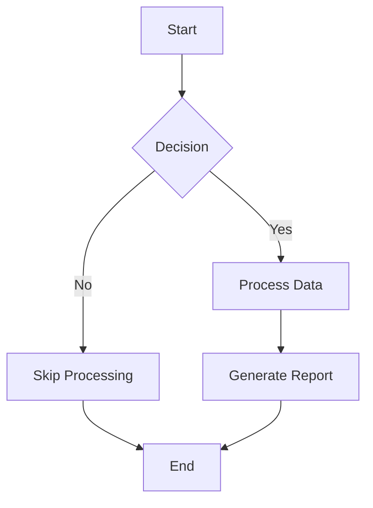
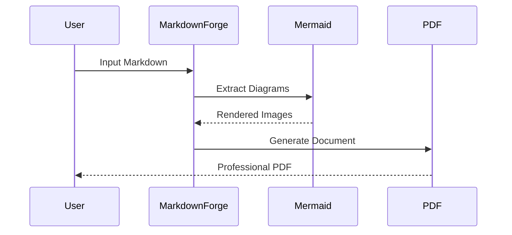
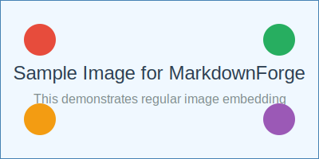

# Image and Diagram Test

This document tests both Mermaid diagrams and regular images in MarkdownForge.

## Mermaid Diagrams

### Flowchart Example



### Sequence Diagram Example



## Regular Images

Here's an example of a regular image that exists in the project:



**Note**: This demonstrates how MarkdownForge handles regular images:
1. Images are automatically detected in the markdown
2. Local image files are embedded as base64 data URLs in PDF
3. Supports PNG, JPG, SVG, and GIF formats
4. Images are responsive and sized appropriately

## Mixed Content

This demonstrates how MarkdownForge handles:

!!! info "Image Processing Features"
    - **Mermaid Diagrams**: Automatically rendered to PNG images
    - **Regular Images**: Embedded as base64 data URLs in PDF
    - **File Formats**: Supports PNG, JPG, SVG, and GIF
    - **Responsive**: Images are sized appropriately for documents

### Code Example

Here's how the image processing works:

```javascript
// Mermaid diagrams are extracted and rendered
const diagrams = await mermaidRenderer.extractDiagrams(content);
const renderedDiagrams = await mermaidRenderer.renderAll(diagrams, tempDir);

// Images are converted to base64 for PDF embedding
const base64Data = fileBuffer.toString('base64');
const dataUrl = `data:${mimeType};base64,${base64Data}`;
```

## Conclusion

MarkdownForge successfully handles both generated diagrams and static images, ensuring they appear correctly in both PDF and DOCX outputs.