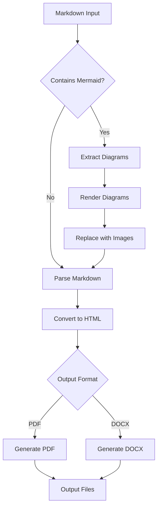
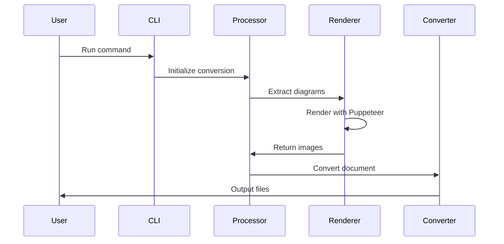

# FileConverter CLI Sample Document

This is a sample Markdown document that demonstrates the capabilities of the FileConverter CLI tool.

## Features

The FileConverter CLI supports:

- **PDF Generation**: High-quality PDF output with customizable themes
- **DOCX Creation**: Microsoft Word compatible documents
- **Mermaid Diagrams**: Automatic rendering of flowcharts and diagrams
- **Multiple Themes**: Choose from default, GitHub, or academic styling

## Mermaid Diagram Example

Here's a simple flowchart showing the conversion process:



## Code Example

Here's how to use the FileConverter CLI:

```bash
# Basic usage
npx fileconverter-cli document.md

# Convert to PDF only
npx fileconverter-cli document.md --format pdf

# Use GitHub theme with verbose output
npx fileconverter-cli document.md --theme github --verbose
```

## Sequence Diagram

This sequence diagram shows the interaction between components:



## Tables

| Feature | PDF | DOCX | Notes |
|---------|-----|------|-------|
| Text Formatting | ✅ | ✅ | Full support |
| Images | ✅ | ✅ | Including diagrams |
| Tables | ✅ | ✅ | Responsive layout |
| Code Blocks | ✅ | ✅ | Syntax highlighting |
| Mermaid Diagrams | ✅ | ✅ | Auto-rendered |

## Lists

### Ordered List
1. Install Node.js (version 16 or higher)
2. Run the conversion command
3. Check the output directory
4. Review generated files

### Unordered List
- Supports multiple output formats
- Cross-platform compatibility
- Zero installation with npx
- Configurable themes and options

## Blockquotes

> "The FileConverter CLI makes document conversion simple and efficient. It's perfect for technical documentation, reports, and presentations."
> 
> — Happy User

## Links and References

- [Project Repository](https://github.com/rauofthameem/markdownforge)
- [NPM Package](https://www.npmjs.com/package/markdownforge)
- [Documentation](https://github.com/rauofthameem/markdownforge/wiki)

## Conclusion

This sample document demonstrates the various features supported by FileConverter CLI. The tool automatically handles:

- Markdown parsing and HTML generation
- Mermaid diagram extraction and rendering
- Theme application and styling
- Multi-format output generation

Try converting this document to see the results!

---

*Generated with FileConverter CLI - Making document conversion simple.*