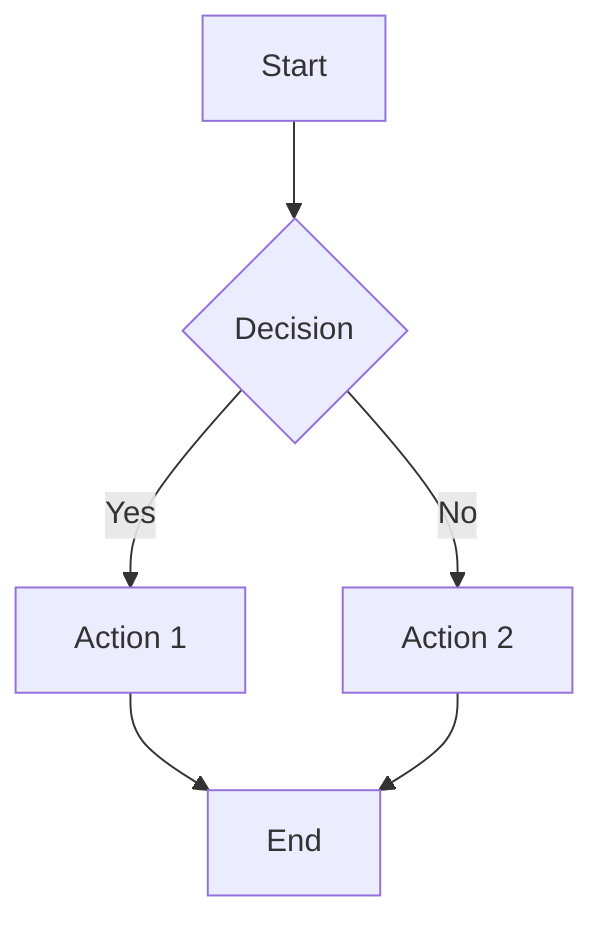
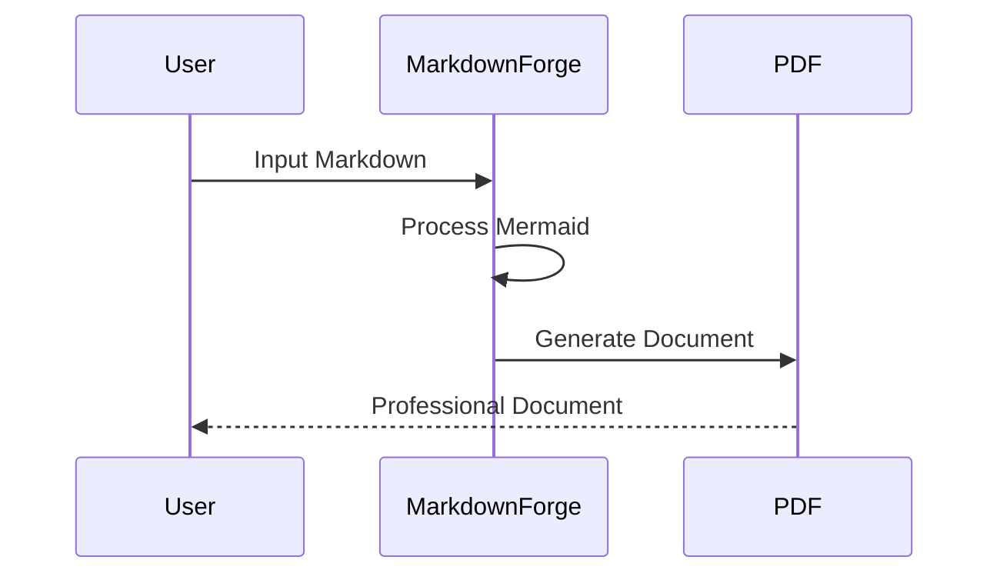

# Mermaid Diagram Test

This document tests Mermaid diagram rendering in MarkdownForge.

## Sample Flowchart

## Sample Sequence Diagram

## Regular Content

This is regular markdown content that should appear normally.